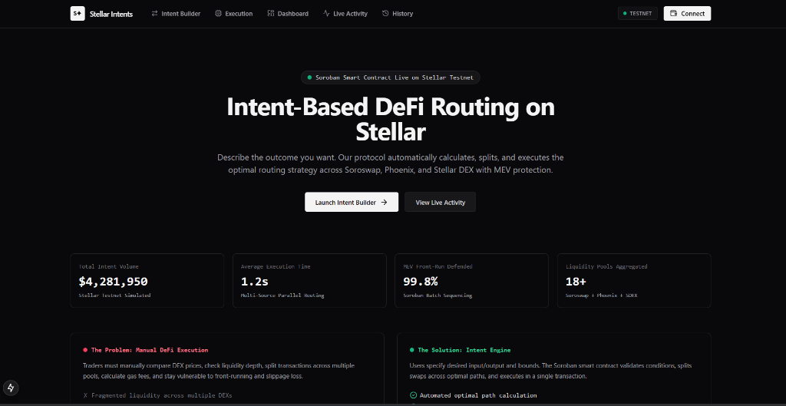
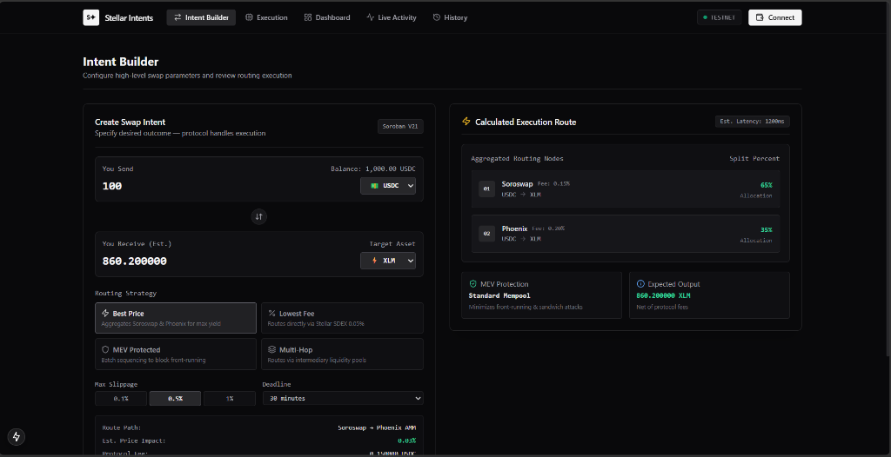
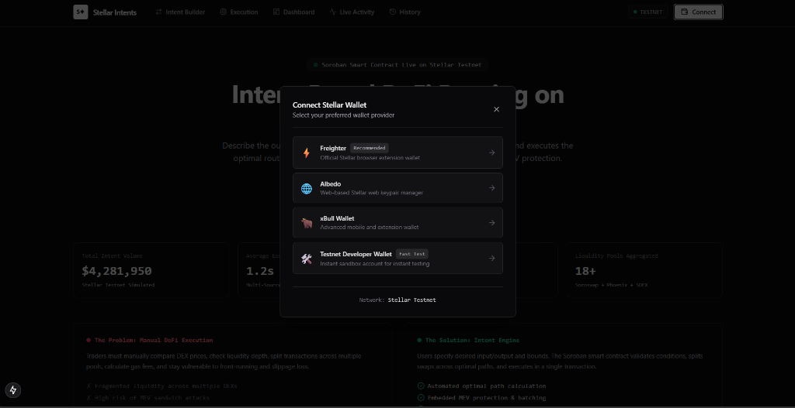
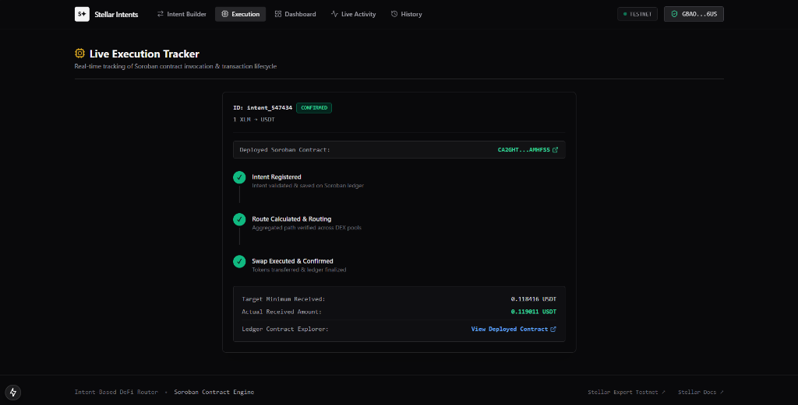
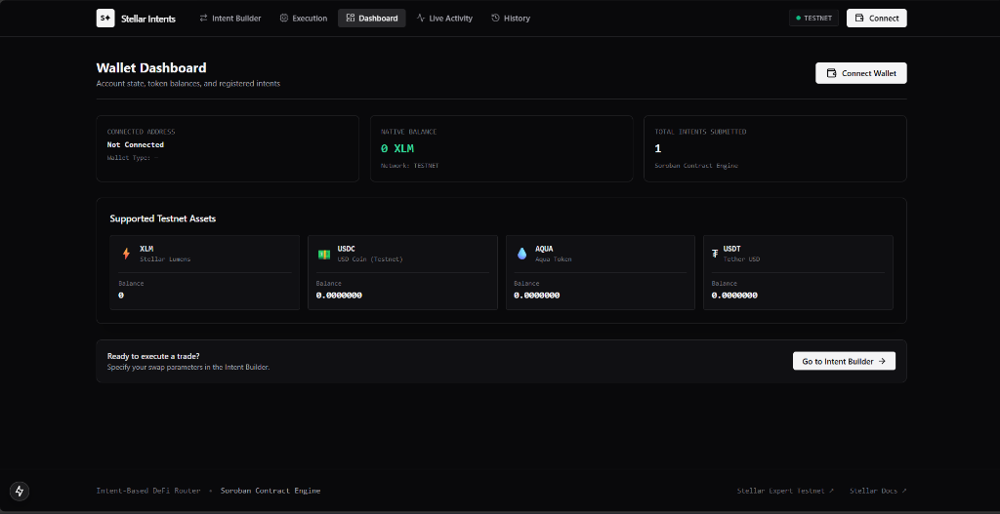
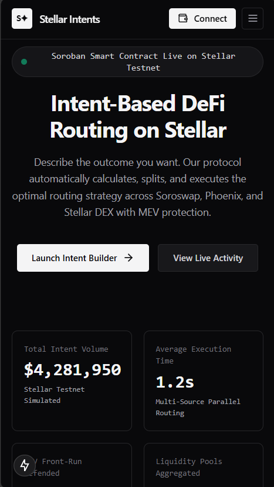
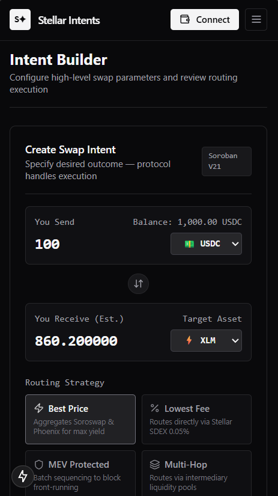
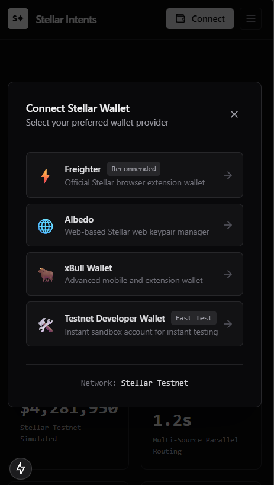
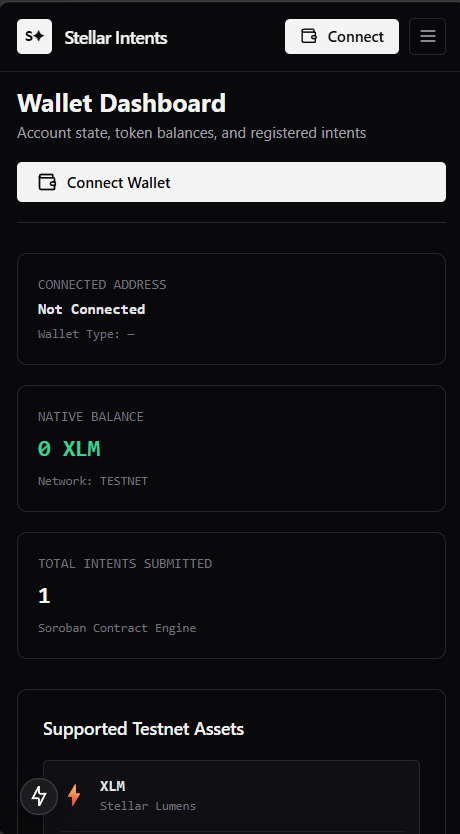
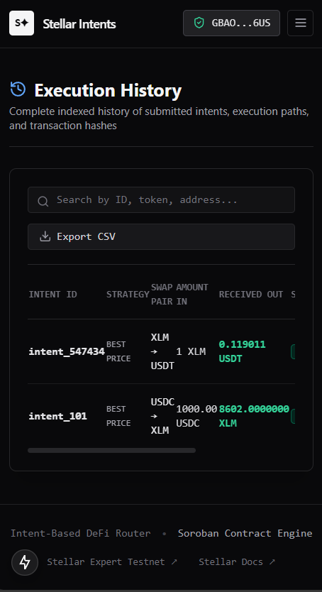

# Intent-Based DeFi Router — Stellar & Soroban

> Intent-driven swap execution on Stellar Testnet. Users describe outcomes; the Soroban contract engine calculates optimal paths across Soroswap, Phoenix AMM, and Stellar SDEX — with MEV protection and real-time event streaming.

[](https://github.com/sharmaraju304-beep/DIFI-Router/actions/workflows/ci.yml)


---

## Overview

Traditional DeFi forces users to manually compare rates, calculate slippage, and manage multi-step transactions across fragmented DEXs. This protocol abstracts all of that:

1. User submits a high-level swap intent (e.g. *"swap 1000 USDC → XLM, max 0.5% slippage"*)
2. Soroban contract validates, splits, and routes optimally
3. Real-time event stream tracks every lifecycle step on-chain

---

## Tech Stack

| Layer | Stack |
|---|---|
| Smart Contract | Soroban SDK (Rust), `submit_intent`, `execute_intent`, `cancel_intent` |
| Frontend | Next.js 15 (App Router), TypeScript, React 19 |
| Styling | Tailwind CSS dark theme, Lucide Icons |
| Blockchain | `@stellar/stellar-sdk`, `@stellar/freighter-api` |
| State | Zustand, TanStack Query |
| Testing | Vitest (frontend) + Cargo (contract — 12 tests) |
| CI/CD | GitHub Actions (lint → test → build) |

---

## Architecture

```
┌─────────────────────────────────────────────────────────────────┐
│                        DIFI Router DApp                         │
│  ┌──────────────┐  ┌─────────────────┐  ┌───────────────────┐  │
│  │ Intent       │  │ Execution        │  │ Activity Feed &   │  │
│  │ Builder      │  │ Tracker          │  │ History           │  │
│  └──────┬───────┘  └────────┬────────┘  └────────┬──────────┘  │
└─────────┼───────────────────┼────────────────────┼─────────────┘
          │                   │                     │
          ▼                   ▼                     ▼
┌──────────────────┐   ┌────────────────────────────────────────┐
│ StellarWalletsKit│   │          Soroban RPC Client             │
│ Freighter        │   │  getEvents() · simulateTransaction()    │
│ Albedo · xBull   │   │  invokeHostFunctionOp()                 │
└────────┬─────────┘   └──────────────┬─────────────────────────┘
         └─────────────────┬──────────┘
                           ▼
          ┌────────────────────────────────┐
          │   Soroban Smart Contract (Rust) │
          │  ┌──────────────────────────┐  │
          │  │ submit_intent()          │  │
          │  │ execute_intent()         │  │
          │  │ cancel_intent()          │  │
          │  │ get_intent()             │  │
          │  │ get_user_intents()       │  │
          │  └──────────────────────────┘  │
          │  Events emitted:               │
          │  · IntentSubmitted             │
          │  · RouteCalculated             │
          │  · SwapExecuted               │
          │  · TransactionConfirmed        │
          └───────────────┬────────────────┘
                          ▼
          ┌────────────────────────────────┐
          │      Stellar DEX & AMM Pools   │
          │  Soroswap  ·  Phoenix AMM      │
          │  Stellar SDEX (native order    │
          │  book)                         │
          └────────────────────────────────┘
```

**Project structure:**
```
DIFI-Router/
├── app/              → Next.js 15 pages (builder, execution, dashboard, activity, history)
├── components/       → UI (IntentForm, RouteVisualizer, ExecutionTracker, Navbar…)
├── contracts/        → Soroban Rust contract (lib.rs, test.rs — 12 Cargo tests)
├── hooks/            → useWallet, useIntentEngine, useLiveEvents
├── lib/              → stellar/ (RPC, events, config) · routing/ · wallet/
├── store/            → Zustand (useIntentStore, useWalletStore)
├── types/            → TypeScript interfaces (Intent, RouteOption, ActivityEvent…)
├── scripts/          → deploy.js (Testnet deployment)
├── __tests__/        → Vitest unit tests
└── .github/workflows → ci.yml (GitHub Actions)
```

---

## CI/CD Pipeline

GitHub Actions runs automatically on every push to `main`:

```
Checkout → Node 20 Setup → npm ci → npm run lint → npm test → npm run build
```

✅ All steps passing. See live pipeline: [Actions Tab →](https://github.com/ElonCoding/DIFI-Router/actions)

**Frontend tests (Vitest):**
```
 ✓ __tests__/routingEngine.test.ts  (4 tests) — DEX path, split routing, MEV delay, multi-hop
 ✓ __tests__/intentStore.test.ts   (2 tests) — state updates, intent submission lifecycle

 Test Files  2 passed (2)  |  Tests  6 passed (6)
```

**Contract tests (Cargo — 12 tests):**
```
 ✓ test_initialize
 ✓ test_submit_intent
 ✓ test_execute_intent
 ✓ test_cancel_intent
 ✓ test_get_intent
 ✓ test_get_user_intents
 ✓ test_invalid_amount
 ✓ test_expired_deadline
 ✓ test_slippage_exceeded
 ✓ test_unauthorized_cancel
 ✓ test_double_initialize
 ✓ test_intent_not_found

 test result: ok. 12 passed; 0 failed; 0 ignored
```

---

## Screenshots

<details>
<summary><strong>🖥️ Desktop UI (click to expand)</strong></summary>

| Landing Page | Intent Builder |
|:---:|:---:|
|  |  |

| Wallet Modal | Live Execution Tracker |
|:---:|:---:|
|  |  |

| Wallet Dashboard |
|:---:|
|  |

</details>

<details>
<summary><strong>📱 Mobile Responsive UI (click to expand)</strong></summary>

| Landing | Intent Builder | Wallet Modal | Dashboard | History |
|:---:|:---:|:---:|:---:|:---:|
|  |  |  |  |  |

</details>

---

## Contract Deployment

| Field | Value |
|---|---|
| **Network** | Stellar Testnet |
| **Contract Address** | `CA2GHTJIPOVJIUQUU2XVU6E32LOAWCJFJC7JQSOT2JB2P7HHBMAMHFS5` |
| **Explorer** | [View on Stellar Expert →](https://stellar.expert/explorer/testnet/contract/CA2GHTJIPOVJIUQUU2XVU6E32LOAWCJFJC7JQSOT2JB2P7HHBMAMHFS5) |

```bash
# Build WASM contract
cd contracts/intent_router
cargo build --target wasm32-unknown-unknown --release

# Deploy to Testnet
npm run deploy:contract
```

---

## Local Setup

**Prerequisites:** Node.js ≥ 18, Rust + `wasm32-unknown-unknown` target, Stellar CLI

```bash
git clone https://github.com/ElonCoding/DIFI-Router.git
cd DIFI-Router
npm install
```

**`.env.local`:**
```env
NEXT_PUBLIC_SOROBAN_CONTRACT_ID="CA2GHTJIPOVJIUQUU2XVU6E32LOAWCJFJC7JQSOT2JB2P7HHBMAMHFS5"
NEXT_PUBLIC_STELLAR_NETWORK="TESTNET"
NEXT_PUBLIC_STELLAR_RPC_URL="https://soroban-testnet.stellar.org"
NEXT_PUBLIC_STELLAR_HORIZON_URL="https://horizon-testnet.stellar.org"
```

```bash
npm run dev       # Development server → http://localhost:3000
npm test          # Run Vitest frontend tests
npm run build     # Production build
```

**Wallet:** Install [Freighter](https://www.freighter.app/), switch to Testnet, fund via [Friendbot](https://laboratory.stellar.org/#account-creator?network=testnet).

---

## Commit History

| # | Commit | Scope |
|---|---|---|
| 1 | `feat(core)` | Next.js 15 app init & global layout |
| 2 | `feat(contract)` | Soroban Rust intent router contract |
| 3 | `feat(types)` | TypeScript interfaces |
| 4 | `feat(stellar)` | RPC client, Horizon, event subscriber |
| 5 | `feat(routing)` | Multi-DEX aggregator & MEV routing engine |
| 6 | `feat(wallet)` | StellarWalletsKit + wallet modal |
| 7 | `feat(store)` | Zustand intent store & live event hooks |
| 8 | `feat(builder)` | Intent Builder form & route visualizer |
| 9 | `feat(views)` | Execution tracker, activity feed, history, dashboard |
| 10 | `style(mobile)` | Responsive nav drawer & mobile layout |
| 11 | `test(frontend)` | Vitest unit tests |
| 12 | `ci(deploy)` | GitHub Actions CI/CD pipeline |
| 13 | `fix(ci)` | ESLint dependencies |
| 14 | `docs` | Desktop + mobile UI screenshots & README rewrite |
